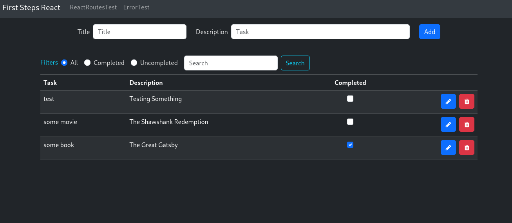

<div align="center"><h1>React-todo-list</h1></div>

 - Todo list practice created to learn React.
 - This project was created using Vite, Bootstrap and local storage for saving data.

<div align="center"><h1>Preview</h1></div>


 
<div align="center"><h1>Want to try it?</h1></div>


1. Clone the repository
```sh
git clone https://github.com/matias-llanquiman/React-todo-list.git
```
2. Install all dependencies
```sh
npm install
```
3. Run the local dev server
```sh
npm run dev
```
